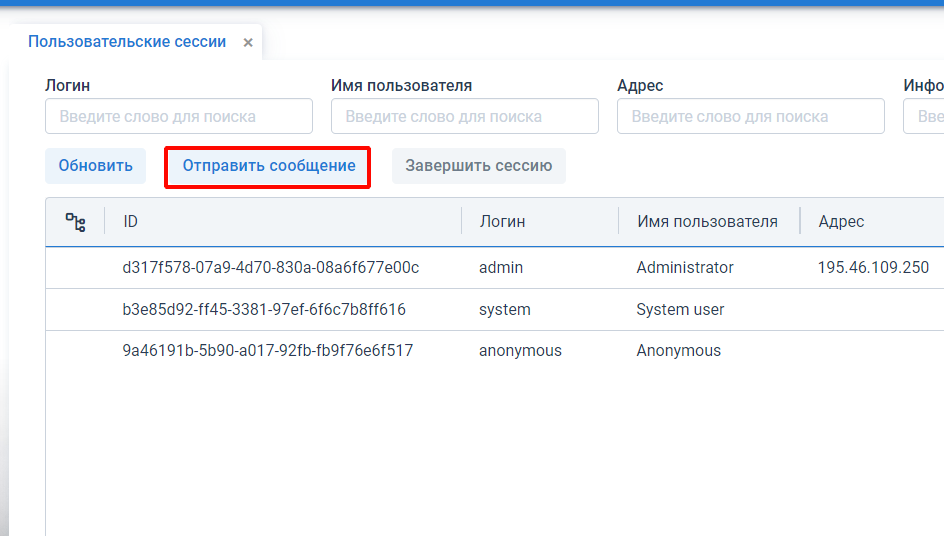
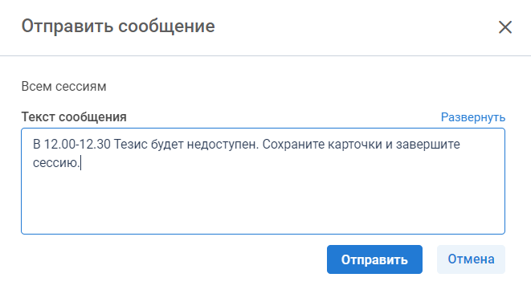
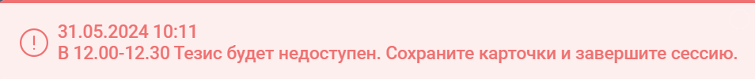
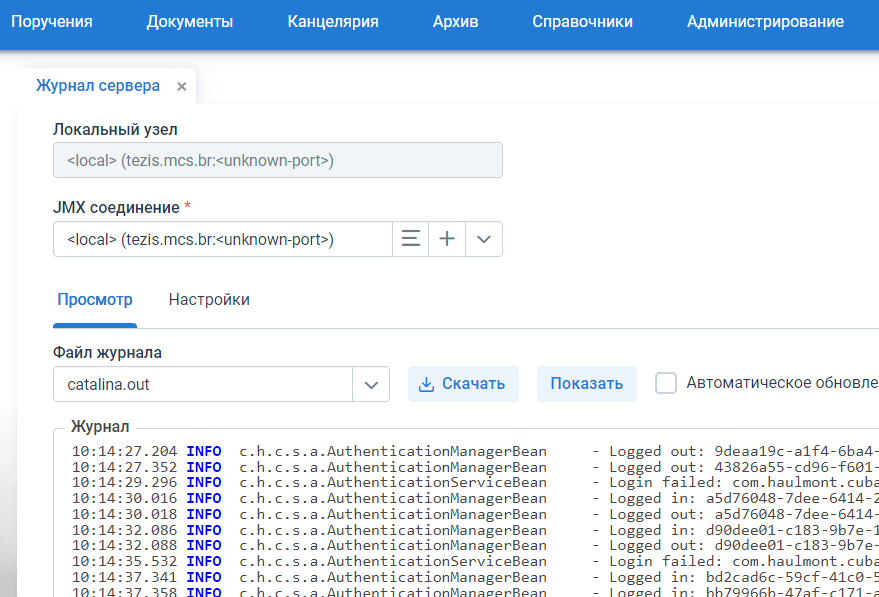
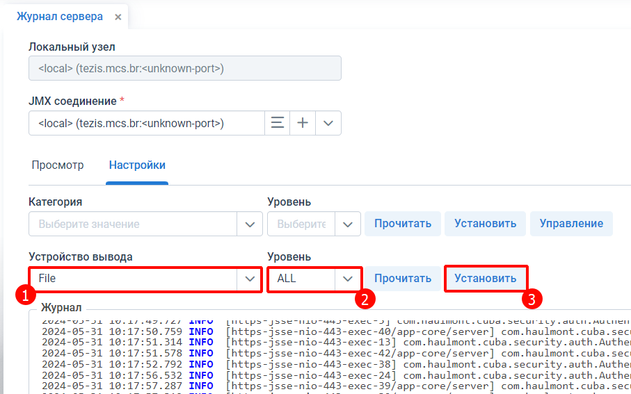
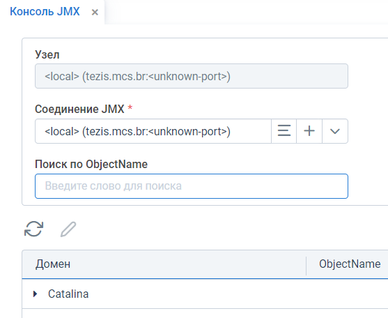
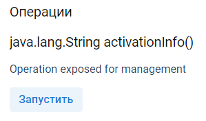

## 1. Работа с пользователями и пользовательскими сессиями
### Уведомление пользователям перед перезагрузкой системы
Пригодится, если в рабочее время надо перезагрузить Тезис.

Заходим в пункт меню **Администрирование** - **Пользовательские сессии**. Нажимаем **Отправить сообщение**:

Вводим сообщение и нажимаем **Отправить**:

Можно использовать такой текст:

> В 12.00-12.30 Тезис будет недоступен. Сохраните карточки и завершите сессию.

Пользователям придет такое сообщение:

---

## 2. Работа с логами
Логи позволяют посмотреть состояние системы более детально. При анализе каких-то ошибок в первую очередь изучаются логи.

### Просмотр и выгрузка логов
Заходим в пункт меню **Администрирование** - **Мониторинг** - **Журнал сервера**:

Тут мы можем посмотреть содержимое и скачать логи.

Основные файлы логов хранятся в файлах:
- app.log
- catalina.out

> **Примечание.** Логи можно выгрузить напрямую с сервера из папки `/logs`.

### Переключение режима логирования
По умолчанию в логи попадают только сообщения об ошибках `ERROR` и предпреждения `WARN`. Логи с типом `DEBUG` или `INFO` по умолчанию выключены, чтобы не засорять логи. 

> **Важно!** После перезагрузки Тезис уровни логирования сбрасываются, поэтому нужно будет ставить их заново.

### Просмотр и выгрузка логов
Заходим в пункт меню **Администрирование** - **Мониторинг** - **Журнал сервера** - вкладка **Настройка**.

Тут меняем:
1. Устройство вывода `Файл`
2. Уровень на `ALL`
3. Нажимаем **Установить**

## 3. Консоль JMIX
Находится в пункте меню **Администрирование** - **Консоль JMIX**.

Для поиска используем **Поиск по ObjectName**.

> **Важно!** Лишних команд лучше не запускать, иначе могут сбиться настройки системы.

### Получить код для активации лицензии

1. В списке JMIX команд выбираем `app-core:service=Licensing` в **Поиск по ObjectName**.
2. Запускаем метод `java.lang.String activationInfo()`
на кнопку **Запустить**. Система сгенерирует активационный ключ - его надо направить Haulmont для формирования новой лицензии.
   

### Включить историю изменений

### Включить историю 
