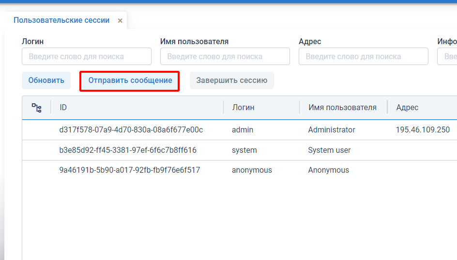
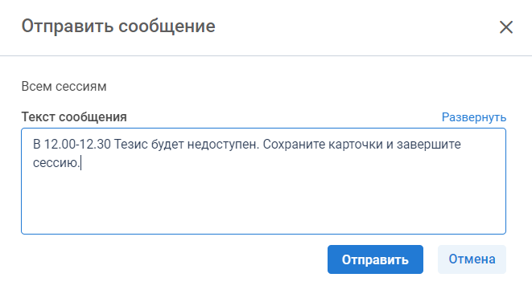
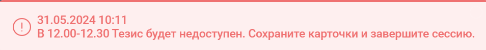
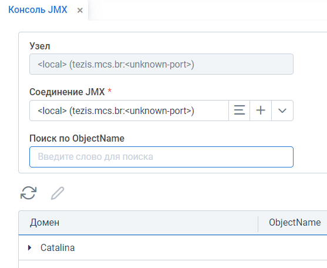
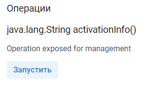
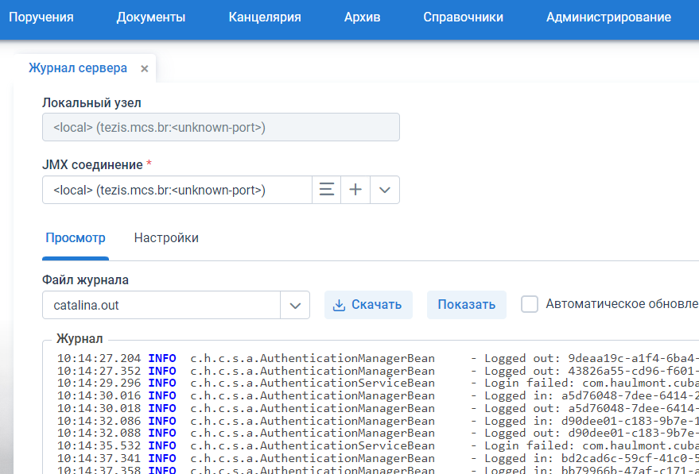
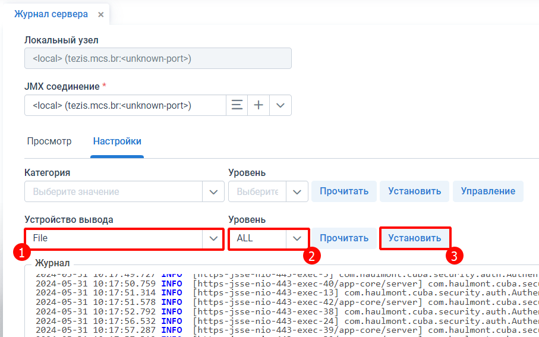

## 1. Работа с пользователями и пользовательскими сессиями
### Уведомление пользователям перед перезагрузкой системы
Пригодится, если в рабочее время надо перезагрузить Тезис.

Заходим в пункт меню **Администрирование** - **Пользовательские сессии**. Нажимаем **Отправить сообщение**:

Вводим сообщение и нажимаем **Отправить**:

Можно использовать такой текст:

> В 12.00-12.30 Тезис будет недоступен. Сохраните карточки и завершите сессию.

Пользователям придет такое сообщение:

---

## 3. Консоль JMIX
Модуль Web Client базового проекта cuba платформы содержит средство просмотра и редактирования JMX объектов. Точкой входа в этот инструмент является экран `com/haulmont/cuba/web/app/ui/jmxcontrol/browse/display-mbeans.xml`, зарегистрированный под идентификатором `jmxConsole`.

Подробнее [см. в документации CUBA](https://doc.cuba-platform.com/manual-latest-ru/jmx_console.html)

Находится в пункте меню **Администрирование** - **Консоль JMIX**.

Для поиска используем **Поиск по ObjectName**.

> **Важно!** Лишних команд лучше не запускать, иначе могут сбиться настройки системы.

### Получить код для активации лицензии

1. В списке JMIX команд выбираем `app-core:service=Licensing` в **Поиск по ObjectName**.
2. Запускаем метод `java.lang.String activationInfo()`
на кнопку **Запустить**. Система сгенерирует активационный ключ - его надо направить Haulmont для формирования новой лицензии.
   

### Включить историю изменений

### Включить историю 

## 4. Папки действий (todo)
В СЭД Тезис есть 2 варианта создания папок действий:
1. Через интерфейс (кнопка **Создать** в списке папок действий). Используя конструктор, можно настроить состояния карточек, которые будут попадать в эту папку.
2. Скриптом с указанием пути к нему. Этот вариант подходит для случаев, когда карточка зависит не только от состояния, но и других параметров. Например "Способ отправки" или подразделение.

> **Примечание.** Если папка создана при помощи скрипта(в скрипте количества указан путь к скрипту, например `com/company/bratsk/core/appfolders/doc/InternalLettersConsiderationQty.groovy`), то ее поправить можно только через этот скрипт.

###  Неверно работает счетчик в папке действия
Бывает, что при смене расположения папок действий сбрасывался счетчик.

**Как решить:**

В пункте меню "Администрирование" - "Консоль JMX"  открыть объект `app-core.cuba:type=ObjectsCacheManager`;
В поле `reloadByName` внести значение "CardCache" и нажать кнопку **Запустить**;
Выйти из системы и войти снова для проверки результата.

## Синхронизация с AD
Настройка доступна через **Системные параметры** - вкладка **"Active Directory"**.

На вкладке задаются параметры для синхронизации пользователей системы
ТЕЗИС с Active Directory

При установленном признаке **«Синхронизация включена»** синхронизация
осуществляется в соответствии со значениями остальных параметров. Если чек-бокс
не отмечен, синхронизация не выполняется и значения остальных параметров
становятся не доступными для редактирования.

> **Важно!** В Системе синхронизация данных о пользователях происходит следующим
>образом:
>- **обновляются** постоянно данные полей – «Логин», «Фамилия», «Имя», «Отчество», «Полное имя», «Табельный номер», «Email»;
>- **не обновляются** постоянно (поддерживается только первичная загрузка)
данные полей – «Подразделение», «Должность», «Номер телефона»
и «Организация». Обновление происходит только в СЭД и только в случае наличия несовпадающей информации по пользователю!

### Процесс синхронизации
При **создании** нового пользователя:
1. Пользователи, подлежащие синхронизации, должны быть созданы в одной группе
в структуре AD, заранее определённой как объект синхронизации, или перенесены
в нее.
2. Система ТЕЗИС периодически выполняет мониторинг AD на предмет наличия
новой информации в группе, подлежащей синхронизации.
3. Учётные записи, отсутствующие в системе ТЕЗИС, создаются в ней автоматически
(проверка осуществляется по логину пользователя).

При **изменении** существующих пользователей:
1. Если нужно отредактировать учетную запись пользователя, то изменения
вносятся в AD.
2. В случае нахождения в AD учётных записей, существующих в справочнике
пользователей системы ТЕЗИС, происходит обновление информации в соответствии
с заданными настройками.
3. При обнаружении блокировки учетной записи пользователя в AD, доступ указанных
пользователей к системе ТЕЗИС будет ограничен с помощью использования атрибута
«Активен».
4. При обнаружении разблокировки учетной записи пользователя в AD, доступ
пользователей будет восстановлен.

При **перемещении** существующих пользователей:
1. Если активная учётная запись будет перенесена из подлежащей синхронизации
группы в другую, то будет выполнена проверка пользователей.
2. Если какой-то из пользователей в структуре AD не найден, его учётная запись
в справочнике пользователей системы ТЕЗИС становится неактивной.
3. Если заблокированная учётная запись AD будет перенесена в группу,
не подлежащую синхронизации, то системой ТЕЗИС данное событие будет
проигнорировано.
Выполнение синхронизации также доступно в ручном режиме. Для этого следует
воспользоваться кнопкой **"Синхронизовать с AD"** в списке пользователей. Кнопка
становится доступной после выставления отметки **«Синхронизация включена»**
в системных параметрах.

Подробную настройку см. в руководстве администратора.

## Мониторинг
Перейти можно через **Администрирование** - **Мониторинг**. Позволяет просматривать:
- Журнал сервера (логи)
- Назначенные задания
- Журнал изменений сущностей
- Стасти

### Журнал сервера (логи)
Здесь можно просматривать логи приложения. Логи позволяют посмотреть состояние системы более детально. При анализе каких-то ошибок в первую очередь изучаются логи.

#### Просмотр и выгрузка логов
Заходим в пункт меню **Администрирование** - **Мониторинг** - **Журнал сервера**:

Тут мы можем посмотреть содержимое и скачать логи.

Журнал `app.log` содержит основную информацию:
- о работе Системы;
- запусках отчётов;
- сведения о возникающих ошибках;
- ход запуска службы.

Остальные журналы, как правило, остаются невостребованными Администратором,
но бывают нужны технической поддержке или разработчикам при возникновении
сложных проблем:
- `catalina.out` - стандартные потоки вывода и ошибок.
- `perfstat.log` - логирование информации о каждом вызове метода и длительности его исполнения.
- `jespa.log` - логирование библиотеки Jespa (библиотека для интеграции с AD)
- `localhost_access_log` - лог обращений к Тезис.

> **Примечание.** Логи можно выгрузить напрямую с сервера из папки `/logs`.

#### Переключение режима логирования
По умолчанию в логи попадают только сообщения об ошибках `ERROR` и предпреждения `WARN`. Логи с типом `DEBUG` или `INFO` по умолчанию выключены, чтобы не засорять логи. 

> **Важно!** После перезагрузки Тезис уровни логирования сбрасываются, поэтому нужно будет ставить их заново.

Заходим в пункт меню **Администрирование** - **Мониторинг** - **Журнал сервера** - вкладка **Настройка**.

Тут меняем:
1. Устройство вывода `Файл`
2. Уровень на `ALL`
3. Нажимаем **Установить**

### Назначенные задания
В ТЕЗИС назначенными заданиями являются: отправка уведомлений (e-mail, SMS), Служба поддержки и другие.

Тут можно их посмотреть, деактивировать и создать. Подробнее см. в Руководстве Администратора.

### Статистика производительности
Экран статистики производительности позволяет производить мониторинг текущих
и средних значений различных параметров за определенные временные срезы: время
работы экрана, общее время работы и т.д.
Для того чтобы открыть статистику производительности, необходимо выбрать пункт
меню **«Администрирование»**– **«Мониторинг»** – **«Статистика производительности»**.

Существующие критерии производительности:
- «Application» – общая информация о времени работы сервера;
- «Memory» – информация об использовании памяти JVM;
- «CPU and Threads» – информация о загрузке процессора Системой
и приложениями, количестве потоков, выделенных в Tomcat;
- «Database» – информация о количестве:
  - активных соединений с БД;
  - соединений с БД в режиме простоя;
  - активных транзакций;
  - транзакций за единицу времени;
- «Requests» – информация о количестве:
  - пользовательских сессий;
  - веб-запросов;
  - запросов к среднему слою;
  - назначенных заданий;
  - назначенных заданий, указанных за единицу времени.
  
### Профилировщик экранов
Профилировщик экранов позволяет собрать информацию по времени открытия
различных экранов пользователями. С помощью него можно определить, где возникла
проблема (долгий ответ сервера, долгая отрисовка в браузере или сетевые задержки).

Для того чтобы открыть профилировщик экранов, необходимо выбрать пункт
меню **«Администрирование»** – **«Мониторинг»** – **«Профилировщик экранов»**.

### Журнал изменений сущности

Предназначен для отслеживания изменений атрибутов сущностей в процессе работы приложения. Измененные значения сохраняются в специальной таблице базы данных, список изменений для конкретного экземпляра сущности может быть отображен в пользовательском интерфейсе.

Если вы хотите его отключить, необходимо установить в `false` атрибут `Enabled` JMX-бина `app-core.cuba:type=EntityLog` и вызвать его операцию `invalidateCache()`.

[См. подробнее](https://doc.cuba-platform.com/manual-latest-ru/entity_log.html)