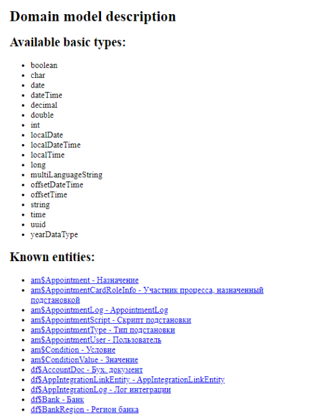
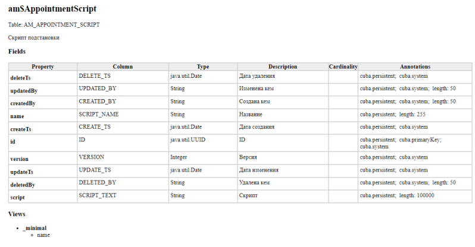

Для отчетов очень полезно пользоваться Моделью данных - она поможет понять какие есть сущности, атрибуты и связи.

## Модель данных

**Модель данных** - это список всех типов и сущностей, используемых
в системе ТЕЗИС и их связей. Модель данных пригодится при создании фильтров, отчетов и создании ограничений для групп доступа.

Для того чтобы открыть модель данных, необходимо выбрать пункт меню
**«Администрирование»** – **«Модель данных»**.



При нажатии на ссылку рядом с названием соответствующей сущности откроется
таблица, в полях которой будут указаны свойства сущности, описание, тип данных и т.д.




## О создании отчетов

Полную инструкцию см. в руководстве [Генератор отчетов системы ТЕЗИС](https://confluence.haulmont.com/pages/viewpage.action?pageId=35193961)

## Сборник рецептов для фильтров
### Фильтр для папки "Согласованные мной"

```
Join: , wf$Assignment a
Where:  a.card.id = {E}.id and a.user.id = :session$userId and a.name = 'Endorsement' and a.outcome = 'Ok'
```

### Фильтр по полю "Сейчас у" в списке документов

```
Join: , wf$Assignment a
Where:  a.card.id = {E}.id and a.user.id in (?) and a.outcome is null
```
Если требуется в условии брать текущего пользователя, то используется: user.id = :session$userId.

### Фильтр "По подразделению" в списке задач

```
Where:  {E}.executor.id in (select em.user.id from df$Employee em where em.department.id = ?)
```


## Сборник рецептов для отчетов

[Основная статья](https://confluence.haulmont.com/pages/viewpage.action?pageId=62096624).

### Адаптирование системного отчета "Лист согласования"

[См. в базе знаний](https://confluence.haulmont.com/pages/viewpage.action?pageId=38605113)

### Отчет с дополнительными полями

Из-за специфики реализации хранения дополнительных полей в системе не имеется возможности вывести их в печатную форму посредством мастера конструктора отчета.

Однако вывести данные поля возможно с помощью запросов на sql\jpql  или скриптом groovy.

Ниже представлены примеры работы с дополнительными полями.

```sql {filename="Пример с SQL"}
select
max(case when t.code='txt' then t.STRING_VALUE else null end) as txtv,
max(case when (t.code='boolean' and t.BOOLEAN_VALUE = true) then 'Да' when (t.code='boolean' and t.BOOLEAN_VALUE =false) then 'Нет' else null end) as boolv,
max(case when t.code='int' then t.integer_value  else null end) as intv
  
from (
 select  v.code,v.integer_value,v.STRING_VALUE, v.BOOLEAN_VALUE
 from df_doc d
 join sys_attr_value v on d.card_id=v.entity_id
 where
  v.entity_id=${entity} 
) t
    
--txt, boolean, int - коды доп.полей вида документа
```

```JPQL {filename="Пример с JPQL"}
select t.booleanValue as boolv from sys$CategoryAttributeValue t  
where t.entityId=${entity} and t.code ='boolean'

select t.stringValue as txtv from sys$CategoryAttributeValue t
where t.entityId=${entity} and t.code ='txt' and t.stringValue is not null

select t.intValue as intv from sys$CategoryAttributeValue t
where t.entityId=${entity} and t.code ='int'
```

```groovy {filename="Пример с groovy"}
import com.haulmont.cuba.core.global.AppBeansimport com.haulmont.cuba.core.global.DataManager
import com.haulmont.cuba.core.global.LoadContext
import com.haulmont.thesis.core.entity.Doc
import com.haulmont.thesis.core.entity.SimpleDoc
 
 
import java.text.SimpleDateFormat
 
SimpleDateFormat sdf = new SimpleDateFormat('dd.MM.yyyy HH:mm')
DataManager dataManager = AppBeans.get(DataManager.NAME)
LoadContext ctx
List<Map<String, Object>> result = [] //контейнер для пар ключ-значение для вывода в печатную форму
Doc entity = (Doc) params.get("entity"); //загружаем документ из параметра отчета
 
ctx = new LoadContext(SimpleDoc.class)
 
ctx.setUseSecurityConstraints(false)
        .setView("browse")
        .setQueryString("select d from df\$SimpleDoc d where d.id = :entityId")
        .setParameter("entityId", entity)  //выгружаем из базы данных информацию по документу
 
ctx.setLoadDynamicAttributes(true); //флаг загрузки связанных с документом доп.полей
SimpleDoc d = dataManager.load(ctx)
 
    def dataInfo =[
            'txtv' : d.getValue('+txt') ? d.getValue('+txt'): "", //обязательно проверять на null. Если поле пустое, то выводить на печать пустую строку
            'boolv' :  d.getValue('+boolean'),
            'intv' :  d.getValue('+int')
    ]
    result.add(dataInfo)
 
return  result
```

[Подробнее см. в базе знаний](https://confluence.haulmont.com/pages/viewpage.action?pageId=62098474)

### Пользователь вызвавший отчет. Вывод его ФИО

Для того, чтобы вывести информацию о пользователе, вызывающем отчет на печать, воспользуйтесь описанными ниже действиями.

Создайте новую полосу `PrintInfo` с типом набора данных groovy

В области скрипта разместите следующий код:

```groovy {filename="PrintInfo"}
import com.haulmont.cuba.core.global.AppBeans;
import com.haulmont.cuba.core.global.UserSessionSource;
  
List<Map<String, Object>> result = []
//обращаемся к информации из сессии пользователя. В отчет будет выводиться ФИО того, от чьего имени идет печать
def data = [
        'who' : AppBeans.get(UserSessionSource.class).getUserSession().getCurrentOrSubstitutedUser().getName()
]
result.add(data)
return result
```

Внутри шаблона печатной формы используйте алиас - `${PrintInfo.who}`

### Как изменить имя отчета

Имя отчета задается на вкладке **Локализация** в настройке отчетов.

### Примеры скриптов для списка 


```groovy
import com.company.bratsk.entity.ExtSimpleDoc
import java.text.SimpleDateFormat
import com.haulmont.cuba.core.global.AppBeans
import com.company.bratsk.service.CardUrlService

CardUrlService cardUrlService = AppBeans.get(CardUrlService.NAME)
SimpleDateFormat sdf = new SimpleDateFormat("dd.MM.yyyy")

def result = []; // тут храним результат, ключ-значение (ключ=ключу в шаблоне отчета)

long counter = 0;
for (ExtSimpleDoc doc : params.entities as List<ExtSimpleDoc>) {
    if (doc.getDocKind().getCode() != null &&  doc.getDocKind().getCode() == 'internalDoc') {
        Map<String, Object> map = new HashMap<String, Object>()

        map.put("num", ++counter)
        map.put("department", doc.getDepartment()!= null ? doc.getDepartment().getName() : "")
        map.put("regNo", doc.getRegNo() != null ? doc.getRegNo() : "")
        map.put("regDate", doc.getRegDate() != null ? sdf.format(doc.getRegDate()) : "")
        map.put("comment", cardUrlService.makeHtmlLink(doc, doc.getComment()))
        map.put("departmentReceiver", doc.getDepartmentReceiver() != null ? doc.getDepartmentReceiver().getName() : "")
        map.put("cardApprover", doc.getCardApprover() != null ? doc.getCardApprover().getName() : "")
        map.put("executor", doc.getOwner() != null ? doc.getOwner().getName() : "") // исполнитель
        map.put("note", doc.getNote() != null ? doc.getNote() : "")
        map.put("state", doc.getState() != null ? doc.getLocState() : "")
        
        result.add(map)
    }
}
return result
```


### Как добавить ссылку в отчет


