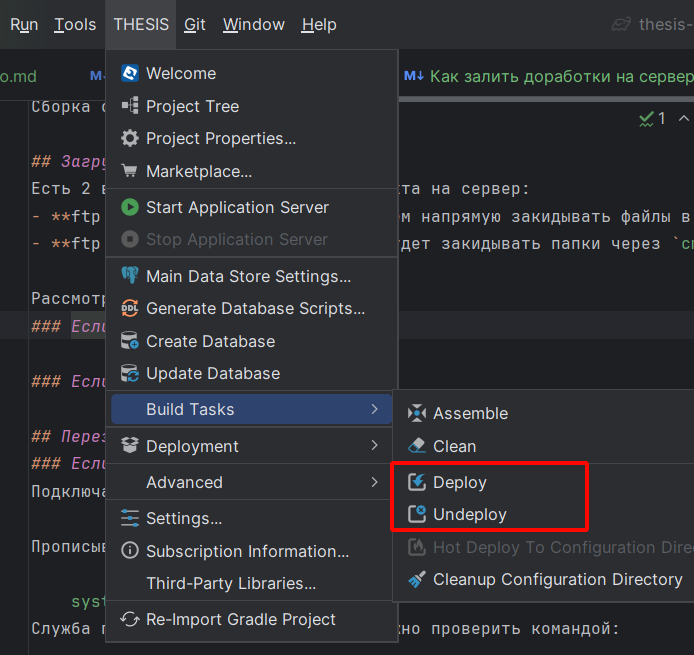
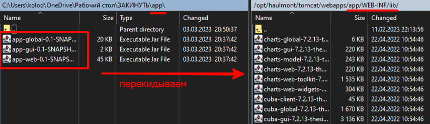
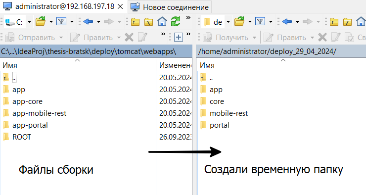
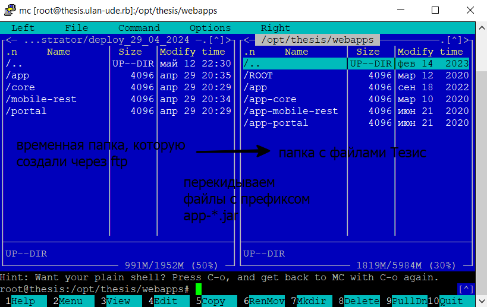
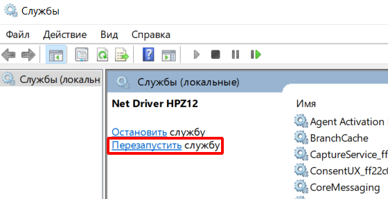
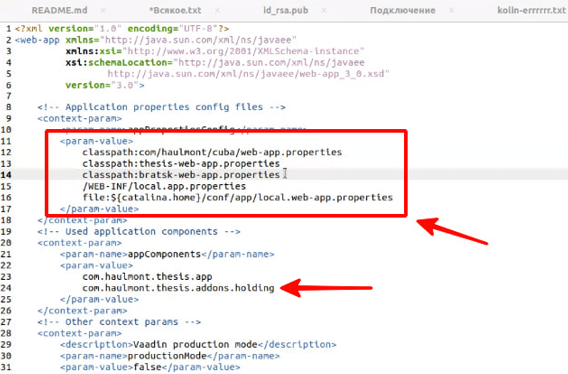

**Деплой** (от англ. deploy, развёртывание, приведение в действие) — это размещение готовой версии программного обеспечения на платформе, доступной для пользователей.

## Используемое ПО

- [InteliJ IDEA](https://www.jetbrains.com/ru-ru/idea/) - IDE для разработки на Java и Kotlin (версия должна быть совместима с плагином Тезис).
- [WinSCP](https://winscp.net/eng/docs/lang:ru) - графический клиент для SFTP подключений.
- [PuTTY](https://putty.org.ru) - клиент для SSH подключений.

## Этапы

Залитие включает в себя следующие этапы:

1. Сборка проекта через Thesis Studio
2. Загрузка файлов проекта на сервер
3. Перезагрузка Тезис

Бонусы

- Обратить внимание при самом первом залитии доработок.
- Как сделать hot fix без перезагрузки сервера.


## Сборка проекта через Thesis Studio

Клонируем изменения из репозитория, добавляем в него папку gradle и открываем проект через InteliJ IDEA.

Выполняем поочередно таски gradle:

- `clean`
- `undeploy`
- `deploy`

Это можно делать через меню **THESIS** - **Build tasks** в InteliJ IDEA



После этого в проекте появится папка `deploy/tomcat` - это и есть проект Тезис. 
На сервере заказчика такая же структура папок (но отличаются конфиг файлы).
Здесь нас интересуют файлы с префиксом `app-` (чаще всего) 
или `garext-` (для Улан-Удэ) по пути

```
tomcat\webapps\app\WEB-INF\
```

В таких файлах содержатся наши доработки. А именно:
- Файлы из папки `app` по пути `tomcat\webapps\app\WEB-INF\lib`
- Файлы из папки `app-core` по пути `tomcat\webapps\app-core\WEB-INF\lib`
- Скрипты из папки `app-core` по пути `app-core\WEB-INF\db\50-credit\update\postgres\...`
- Файлы из папки `app-mobile-rest` по пути `tomcat\webapps\app-mobile-rest\WEB-INF\lib`

Эти файлы нужно теперь перенести на сервер клиента, чтобы структура папок и скриптов
была аналогична.

## Загрузка файлов проекта на сервер
ДЕЛАЕМ БЭКАП папки `webapps`, а желательно и бэкап БД (если есть новые скрипты). 
Если это продуктовая база, то лучше забэкапить все, что можно.

Есть 2 варианта загрузки файлов проекта на сервер:
- **ftp доступ есть**. Тогда мы сможем напрямую закидывать файлы в нужные нам папки.
- **ftp доступа нет**. Тогда нужно будет закидывать папки по ssh через командную строку (far manager).

Рассмотрим оба.
### Если ftp доступ есть
Просто закидываем файлы сборки в соответсвующие им пути на сервере по ftp.
В каждой папке переходим по пути `WEB-INF/lib` и перекидываем туда файлы из каждой папки соответственно:



### Если ftp доступа нет
Тут появляется промежуточный пункт, т. к. у нас нет прямого 
доступа к папке тезис на сервере:
1. Закидываем файлы сборки во временную папку на сервере по ftp.



2. Через ssh переносим файлы из временной папки 
 в соответсвующие им пути на сервере с помощью команды `sudo mc`:




## Перезагрузка Тезис
### Если unix сервер
Подключаемся к серверу по SSH. Например через программу [PuTTY](https://putty.org.ru).

Прописываем команду для перезапуска службы Тезис
```
systemctl restart thesis.service
```
Если прав недостаточно, то используем команду:
```
sudo systemctl thesis.service
```
Ее статус службы можно проверить командой:
```
systemctl status thesis.service
```


### Если windows сервер
1. Заходим в приложение "Службы".
2. Ищем службу, которая в наименовании содержит "Tomcat".
3. Нажимаем "Перезапустить".




## Обратить внимание при самом первом залитии доработок
Если у заказчика чистый тезис без доработок, то нужно проверить следующее:

1. В файле 
````
/opt/haulmont/tomcat/conf/app-core/local.app.properties
````
прописать строку 

```
cuba.dataSourceProvider = jndi
```

2. Также надо проверить файлы `web.xml` в папках `webapps`. 
Должно быть так (сравнивай с файлами проекта расширения):



## Как сделать hot fix без перезагрузки сервера

Все что есть в модуле `web` можно подкидывать при помощи **hot deploy**.
Это позволяет закидывать исправления без остановки Тезис.
Для этого скопировать относительный путь изменяемого класса,
в папку `deploy/conf` положить измененный файл.
В этом случае обязательно перед обновлением базы очищать эту папку.

Подробнее о hot deploy [см. в документации cuba](https://doc.cuba-platform.com/manual-6.10/hot_deploy.html).