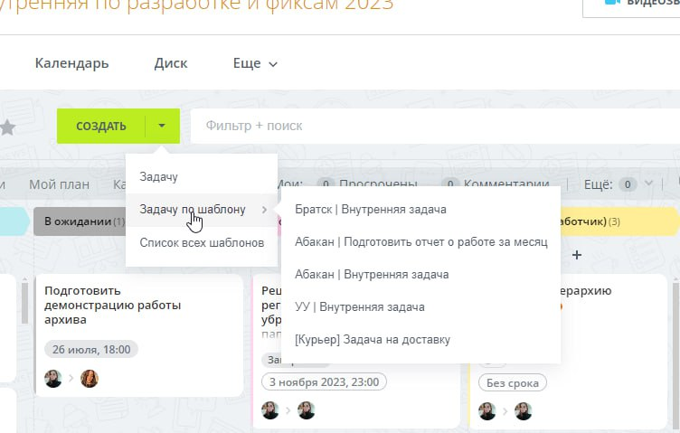
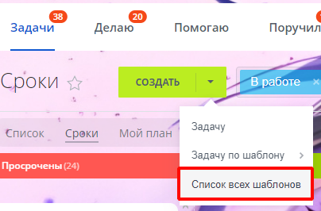
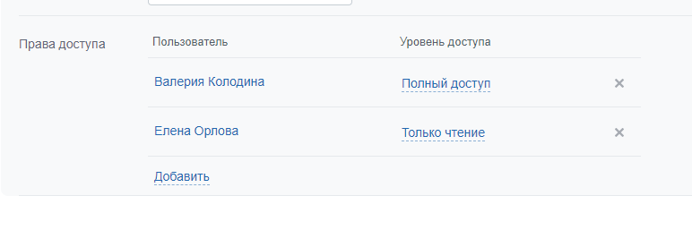

Для удобства рекомендую использовать шаблоны Битрикс24. Есть уже несколько готовых по проектам:

Эти шаблоны могут заполнить:

- Участников процесса (наблюдатели, постановщик, исполнитель).
- Группу (проект) для задачи.
- Сделку.

> Группы и сделки могут меняться при закрытии сделки, поэтому инфо нужно обновлять.

## Доступ к шаблону. Редактирования шаблона

Если доступа нет, то вот тут его можно добавить:

Заходим в шаблоны задач:

Заходим у нужную задачу и нажимаем **Редактировать**. В окне редактирования нажимаем **Дополнительно**, листаем в самый низ до поля **Права доступа**:

Тут можно добавить нового или отредактировать текущий доступ.

> **Примечание.** Если у вас доступа на редактирования нет, то можно попросить об этом администратора Битрикс24 или создателя шаблона.
